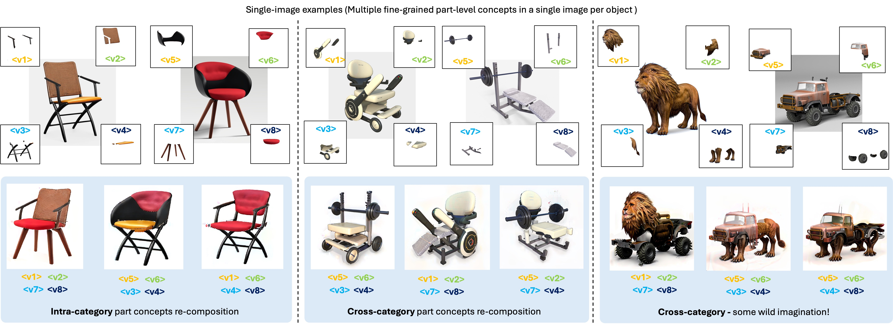

# PartComposer: Learning and Composing Part-Level Concepts from Single-Image Examples
Published as a SIGGRAPH Asia 2025 Conference Paper [[website](https://junyu-liu-nate.github.io/partcomposer.github.io/)] [[paper](https://arxiv.org/pdf/2506.03004)]

**Authors**: Junyu Liu, R. Kenny Jones, Daniel Ritchie



## Env Config and Pre-trained Models

All required env configs are specified in ```requirements.txt```. You can create a workable virtual environment by running the following code.
```
python -m venv <your_env_name>
source <your_env_name>/bin/activate
pip install -r requirements.txt
```

We use StableDiffusion v2.1 as pretrained model. The HuggingFace page for the model can be accessed using this [link](https://huggingface.co/stabilityai/stable-diffusion-2-1-base).

## Data

All of data (single-image examples) used in our paper can be found in ```./examples```.

## Run code

### Train
We recommend using "Weights & Bias" to visualize the inferenced output during training steps。
```
python trainer.py \
  --pretrained_model_name_or_path "[customized path]/pretrained_models/stable-diffusion-2-1-base" \
  --subject_name 'chair' \
  --instance_data_dir examples/chair_09_299  \
  --assets_indices_lists "0,1,2,3;4,5,6,7" \
  --initializer_tokens_list "'armrest','backrest','legs','seat';'armrest','backrest','legs','seat'" \
  --val_mix_prompts "a photo of a chair with <asset0> and <asset1> and <asset6> and <asset7>, on a simple white background." \
                    "a photo of a chair with <asset4> and <asset5> and <asset2> and <asset3>, on a simple white background." \
                    "a photo of a chair with <asset0> and <asset5> and <asset2> and <asset7>, on a simple white background." \
                    "a photo of a chair with <asset4> and <asset1> and <asset6> and <asset3>, on a simple white background." \
  --final_inference_prompts "a photo of a chair with <asset4> and <asset1> and <asset2> and <asset3>, on a simple white background." "a photo of a chair with <asset0> and <asset5> and <asset2> and <asset3>, on a simple white background." "a photo of a chair with <asset0> and <asset6> and <asset2> and <asset3>, on a simple white background." "a photo of a chair with <asset0> and <asset1> and <asset2> and <asset7>, on a simple white background." \
                            "a photo of a chair with <asset0> and <asset5> and <asset6> and <asset7>, on a simple white background." "a photo of a chair with <asset4> and <asset1> and <asset6> and <asset7>, on a simple white background." "a photo of a chair with <asset4> and <asset2> and <asset6> and <asset7>, on a simple white background." "a photo of a chair with <asset4> and <asset5> and <asset6> and <asset3>, on a simple white background." \
                            "a photo of a chair with <asset0> and <asset1> and <asset6> and <asset7>, on a simple white background." "a photo of a chair with <asset0> and <asset5> and <asset6> and <asset3>, on a simple white background." "a photo of a chair with <asset4> and <asset5> and <asset2> and <asset3>, on a simple white background." "a photo of a chair with <asset4> and <asset1> and <asset2> and <asset7>, on a simple white background." \
  --class_data_dir inputs/data_dir \
  --phase1_train_steps 6400 \
  --phase2_train_steps 40000 \
  --output_dir outputs/chair_09_299 \
  --log_checkpoints \
  --img_log_steps 400 \
  --no_prior_preservation \
  --report_to "wandb" \
  --wandb_run_name "chair_09_299" \
  --randomize_unused_mask_areas \
  --learning_rate 2e-6 \
  --sample_type per-part --synth_type random-overlap \
  --train_concept_predictor --predictor_type "classifier_seg" --concept_pred_weight 0.05 --concept_pred_seg_scale 10.0 \
  --lora_rank 32 --sythn_detailed_prompt \
  --train_detailed_prompt --set_bg_white --apply_bg_loss --bg_loss_weight 0.01 \
  --log_concept_predictor --log_masks --log_atten_maps
```

### Inference

```
python inferencer.py \
  --model_path <saved model path - the checkpoint folder name> \
  --output_path <specify output path for the saved images> \
  --pretrained_model_name_or_path stabilityai/stable-diffusion-2-1-base \
  --instance_data_dir examples/chair_09_299 \
  --prompts "a photo of a chair with <asset0> and <asset1> and <asset2> and <asset3>, on a simple white background." \
            "a photo of a chair with <asset0> and <asset1> and <asset2> and <asset7>, on a simple white background." \
            "a photo of a chair with <asset0> and <asset1> and <asset6> and <asset3>, on a simple white background." \
            "a photo of a chair with <asset0> and <asset1> and <asset6> and <asset7>, on a simple white background." \
            "a photo of a chair with <asset0> and <asset5> and <asset2> and <asset3>, on a simple white background." \
            "a photo of a chair with <asset0> and <asset5> and <asset2> and <asset7>, on a simple white background." \
            "a photo of a chair with <asset0> and <asset5> and <asset6> and <asset3>, on a simple white background." \
            "a photo of a chair with <asset0> and <asset5> and <asset6> and <asset7>, on a simple white background." \
            "a photo of a chair with <asset4> and <asset1> and <asset2> and <asset3>, on a simple white background." \
            "a photo of a chair with <asset4> and <asset1> and <asset2> and <asset7>, on a simple white background." \
            "a photo of a chair with <asset4> and <asset1> and <asset6> and <asset3>, on a simple white background." \
            "a photo of a chair with <asset4> and <asset1> and <asset6> and <asset7>, on a simple white background." \
            "a photo of a chair with <asset4> and <asset5> and <asset2> and <asset3>, on a simple white background." \
            "a photo of a chair with <asset4> and <asset5> and <asset2> and <asset7>, on a simple white background." \
            "a photo of a chair with <asset4> and <asset5> and <asset6> and <asset3>, on a simple white background." \
            "a photo of a chair with <asset4> and <asset5> and <asset6> and <asset7>, on a simple white background."
```

## Structure of the repo
Training-related code:
```
trainer.py
|- trainer_modules/   ### Training related modules
```
Inference-related code:
```
inferencer.py
|- inference_modules/ ### Inference related modules
```
Common modules:

```
|- modules/         ### Key modules in the pipeline
|- utils/           ### Data(set) loading/saving/processing
```

## Reference

If you find our work helpful, we'd appreciate it if you could cite our paper
```
@article{liu2025partcomposer,
  title={PartComposer: Learning and Composing Part-Level Concepts from Single-Image Examples},
  author={Liu, Junyu and Jones, R Kenny and Ritchie, Daniel},
  journal={arXiv preprint arXiv:2506.03004},
  year={2025}
}
```

Part of the code in this repo is referenced from Break-a-Scene. We add the citation to their paper here.
```
@inproceedings{avrahami2023bas,
  author = {Avrahami, Omri and Aberman, Kfir and Fried, Ohad and Cohen-Or, Daniel and Lischinski, Dani},
  title = {Break-A-Scene: Extracting Multiple Concepts from a Single Image},
  year = {2023},
  isbn = {9798400703157},
  publisher = {Association for Computing Machinery},
  address = {New York, NY, USA},
  url = {https://doi.org/10.1145/3610548.3618154},
  doi = {10.1145/3610548.3618154},        
  booktitle = {SIGGRAPH Asia 2023 Conference Papers},
  articleno = {96},
  numpages = {12},
  keywords = {textual inversion, multiple concept extraction, personalization},
  location = {, Sydney, NSW, Australia, },
  series = {SA '23}
}
```